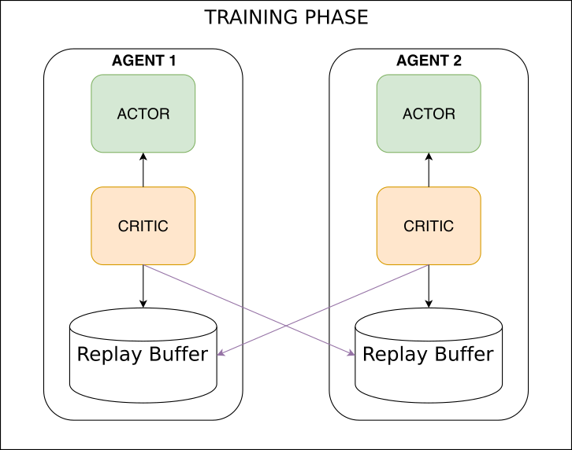
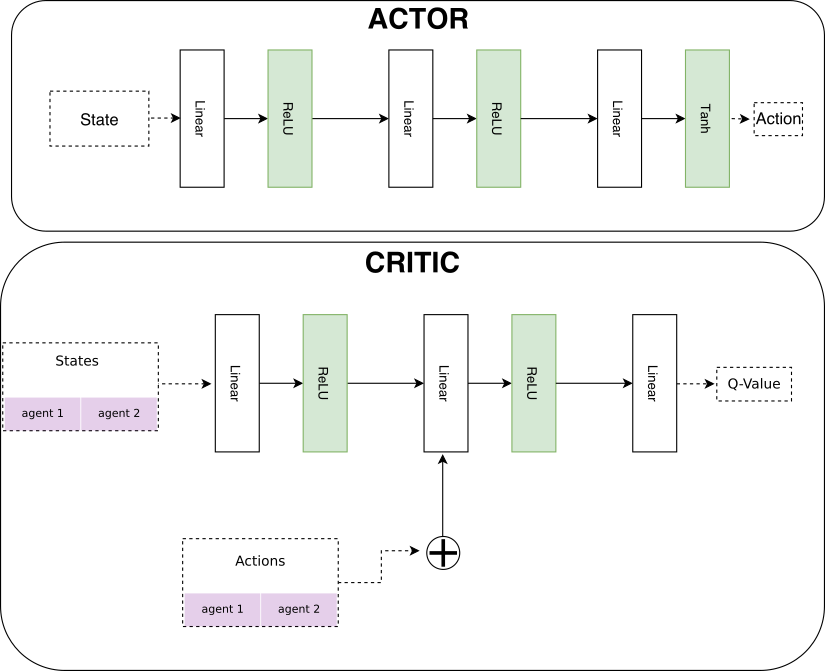
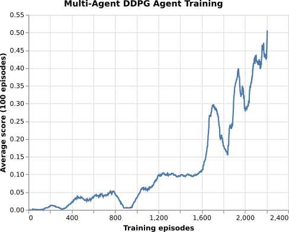
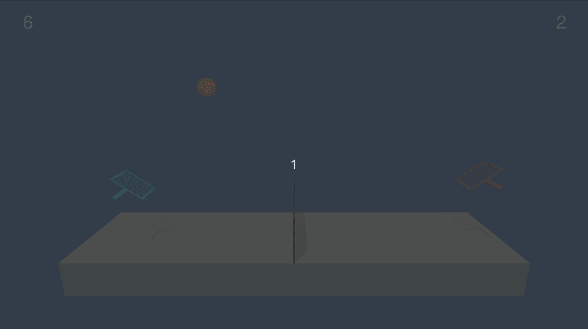
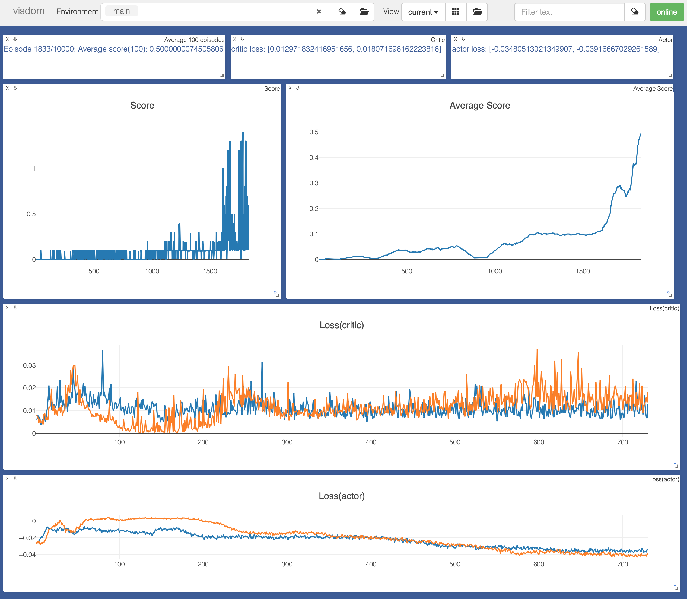

[//]: # (Image References)
# Tennis

The Tennis environment requires the two competing agents to learn from high dimensional state space and perform actions in continuous action space. 

The algorithm such as DQN can solve problems with high dimensional state space but only work on discrete and low-dimensional action spaces. 
The policy based methods such as REINFORCE can learn the policy to map state into actions but they are sample inefficient, noisy because 
we are sampling a trajectory (or a few trajectories) which may not truly represent the policy and could prematurely converge to local optima. 

The solution used in this report makes use of the approach presented in the [paper](https://arxiv.org/abs/1706.02275) "Multi-Agent Actor-Critic for Mixed Cooperative-Competitive Environments".
It makes use of Actor-Critic networks, same as Deep deterministic policy gradients paper, but instead of training each agent to learn from its own action it incorporates the actions taken by all agents. 
This is done by letting the Critic network of each agent to see the actions taken by all the agents and use it to guide the Actor to come up with a better policy.



The Actor network takes state as input and returns the action whereas the Critic network takes states and actions of all agents as input and returns the action-value (Q-value).
The Critic in this case is a DQN with local and fixed target networks along with a replay buffer. 
The local Critic and Actor networs are trained by sampling experiences from the replay buffer.


# Network Architecture

We use fully connected layers for both Actor and Critic network in pytorch 0.4.



# Hyper parameters

I tried several hyperparameters in order to solve the environment along with the ones specified by DDPG paper. In the end, the following worked the best.

|Parameter|Value|Description|
|---------|-----|-----------|
|BUFFER_SIZE|1e5|Replay memory buffer size|
|BATCH_SIZE|512|Minibatch size|
|GAMMA|0.95|Discount factor|
|TAU|1e-2|Soft update of target parameters|
|LR_ACTOR|1e-3|Actor learning rate|
|LR_CRITIC|1e-3|Critic learning rate|
|WEIGHT_DECAY|0|L2 weight decay|
|SCALE_REWARD|1.0|Reward scaling|
|SIGMA|0.01|OU Noise std|
|LEARN_STEP|1|How often to learn|
|CLIP_GRADS|True|Clip gradients|
|CLAMP_VALUE|1|Clip value (e.g a value of 1 gets set as -1,+1)|
|FC1|64|input channels for 1st hidden layer|
|FC2|64|input channels for 2nd hidden layer|

The two agents were trained for 5000 timesteps per episode.

# Performance

The environment was solved in **2206 episodes**.

The training plot shows the average rewards of 100 episodes  


We can watch the trained agent play using player.py, for example the command below loads a saved model to play tennis.

```
python player.py --env ./env/Tennis_Linux/Tennis.x86_64 --agent maddpg --model ./checkpoint/maddpg/multi
```



## Visdom Plot

The following screenshot from visdom shows the average score (shown above) and plot of over all score along with critic and actor losses. I found it very useful during the training phase when I was trying out various hyperparams.




# Future Work

We solved the environment using multi-agent deep deterministic policy gradients (MADDPG). 
The environment was solved in fewer episodes in comparison with deep deterministic policy gradients solution (see Report_DDPG.md).
I found that training was very sensitive to soft update parameter (TAU), discount factor (GAMMA), Gradient clipping and number of steps in an episode. The following could be explored to improve training time and performance: 

* reduce network size either by remove one hidden layer or decreasing the number of units as this would result in a lot less parameters.
* increase the learning rate and introduce weight decay (currently set to 0) to speed up the learning
* implement ensemble policies to improve training performance (details below)


The Multi-agent reinforcement learning suffers from environment non-stationarity problem because the agent(s) policies change during the training. This could lead to agents learning the behaviour of their competitors which is undesirable because they may fail when competitors alter their strategies.The MADDPG paper suggests that we can tackle this issue by making use of ensemble of policies where each agent trains a fixed number of sub-policies and at each episode a random policy per agent is chosen to execute the actions. This way, the agent and its competitors use one of the sub-policies at each episode.


