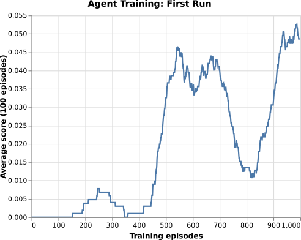

[//]: # (Image References)

# Tennis

The Tennis environment require the two agents to learn from high dimensional state space and perform actions in continuous action space. 

The algorithm such as DQN can solve problems with high dimensional state space but only work on discrete and low-dimensional action spaces. The policy based methods such as REINFORCE can learn the policy to map state into actions but they are sample inefficient, noisy because we are sampling a trajectory (or a few trajectories) which may not truly represent the policy and could prematurely converge to local optima. 

The solution used in this repo makes use of actor-critic approach proposed by Lillicrap et al in deep deterministic policy gradient [paper](https://arxiv.org/abs/1509.02971).

The actor network takes state as input and returns the action whereas the critic network takes state and action as input and returns the value. 

The critic in this case is a DQN with local and fixed target networks and replay buffer. The local network is trained by sampling experiences from replay buffer and minimising the loss function.


The actor is updated using sampled policy gradient.


In multi-agent scenario, each agent uses its own Actor-Critic networks and Replay memory buffer. The actions taken by other agents is not taken into account. 

# Network Architecture

We use fully connected layers for both Actor and Critic network in pytorch 0.4.


# Hyper parameters

I tried several hyperparameters in order to solve the environment along with the ones specified by DDPG paper. In the end, the following worked the best.

|Parameter|Value|Description|
|---------|-----|-----------|
|BUFFER_SIZE|2e5|Replay memory buffer size|
|BATCH_SIZE|256|Minibatch size|
|GAMMA|0.9|Discount factor|
|TAU|1e-3|Soft update of target parameters|
|LR_ACTOR|1e-3|Actor learning rate|
|LR_CRITIC|1e-3|Critic learning rate|
|WEIGHT_DECAY|0|L2 weight decay|
|SCALE_REWARD|1.0|Reward scaling|
|SIGMA|0.01|OU Noise std|
|FC1|32|input channels for 1st hidden layer|
|FC2|16|input channels for 1st hidden layer|

The two agents were trained for 1000 timesteps per episode.

# Performance

The environment was solved in **3448 episodes** and the agents were trained in two runs.
The model checkpoints from the first run were used as starting point for the second run.

The training plot of first run 



The training plot of second run 


Watch the trained agent play by running the following script

```
python player.py --env env/Tennis_Linux/Tennis.x86_64 --agent ddpg --model checkpoint/ddpg/multi
```


## Visdom Plot

The following screenshot from visdom shows the average score (shown above) and plot of over all score along with critic and actor losses. I found it very useful during the training phase when I was trying out various hyperparams.


# Future Work

At this point, I was unable to get multi-agent ddpg (MADDPG) to work properly. The next steps is to get MADDPG to solve the environment.